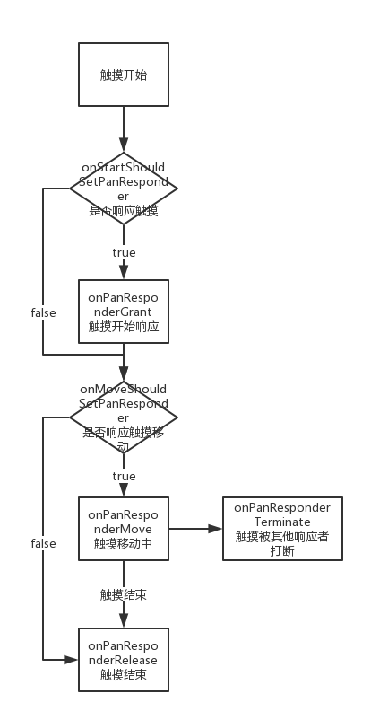

# react native demo

## TODO
* WebView
* RefreshControl
* StatusBar
* Navigator

## 手势
#### Touchable**触摸控件
* TouchableHighlight,
* TouchableNativeFeedback,
* TouchableOpacity,
* TouchableWithoutFeedback
> 他们的功能和使用方法基本类似，只是在Touch的时候反馈的效果不同，他们有以下几个回调方法：
* onPressIn:点击开始
* onPressOut:点击结束或离开
* onPress:单击事件回调
* onLongPress：长按事件回调

### PanResponder - 让普通的组件成为触摸事件的响应者
> 普通的组件并不能设置点击事件，如View（Text可设置点击事件）、Image等，那是因为普通的组件，它并不是触摸响应者
#### 1、申请成为响应者
通过两个(属性)方法去"询问"一个 View 是否愿意成为响应者
```javascript
// 该属性接受一个回调函数，如果返回true则申请成为触摸事件的响应者
View.props.onStartShouldSetPanResponder: (evt, gestureState) => true
```
```javascript
// 该属性接受一个回调函数，如果返回true则申请成为滑动过程中的响应者
View.props.onMoveShouldSetPanResponder: (evt, gestureState) => true
```
#### 2、捕获 ShouldSet 事件处理
onStartShouldSetPanResponder与onMoveShouldSetPanResponder是以冒泡的形式调用的，即嵌套最深的节点最先调用。这意味着当多个 View 同时在*ShouldSetResponder中返回 true 时，最底层的 View 将优先“夺权”。在多数情况下这并没有什么问题，因为这样可以确保所有控件和按钮是可用的。

但是有些时候，某个父 View 会希望能先成为响应者。我们可以利用“捕获期”来解决这一需求。响应系统在从最底层的组件开始冒泡之前，会首先执行一个“捕获期”，在此期间会触发on*StartShouldSetPanResponderCapture系列事件。因此，如果某个父 View 想要在触摸操作开始时阻止子组件成为响应者，那就应该处理onStartShouldSetResponderCapture事件并返回 true 值。
```javascript
// 表示是否成为触摸事件的劫持者，返回true，则不会把事件传递给它的子元素
View.props.onStartShouldSetPanResponderCapture: (evt, gestureState) => true
```
```javascript
// 表示是否成为滑动事件的劫持者，返回true，则不会把滑动事件传递给它的子元素
View.props.onMoveShouldSetPanResponder: (evt, gestureState) => true
```

在实际的代码中，我们经常通过以下方式设置PanResponder来申请和监听触摸事件的
```javascript
View.props.onStartShouldSetPanResponder: (evt, gestureState) => true,
View.props.onStartShouldSetPanResponderCapture: (evt, gestureState) => true,
View.props.onMoveShouldSetPanResponder: (evt, gestureState) => true,
View.props.onMoveShouldSetPanResponderCapture: (evt, gestureState) => true
```

#### 2、开始手势操作
```javascript
View.props.onPanResponderGrant: (evt, gestureState) => {
  // 开始手势操作。此时应给用户一些视觉反馈，让他们知道发生了什么事情！
  // gestureState.{x,y} 现在会被设置为0
}
```
#### 3、滑动
```javascript
View.props.onPanResponderMove: (evt, gestureState) => {
  // 最近一次的移动距离为gestureState.move{X,Y}
  // 从成为响应者开始时的累计手势移动距离为gestureState.d{x,y}
}
```
#### 4、触摸结束
```javascript
View.props.onPanResponderTerminationRequest: (evt, gestureState) => true,
View.props.onPanResponderRelease: (evt, gestureState) => {
  // 用户放开了所有的触摸点，且此时视图已经成为了响应者。
  // 一般来说这意味着一个手势操作已经成功完成
}
```
#### 5、新的组件已经成为了新的响应者，当前手势被取消
```javascript
View.props.onPanResponderTerminate: (evt, gestureState) => {
  // 另一个组件已经成为了新的响应者，所以当前手势将被取消
}
```
#### 6、当前组件是否应该阻止原生组件成为JS响应者（暂只支持android）
```javascript
View.props.onShouldBlockNativeResponder: (evt, gestureState) => {
  // 返回一个布尔值，决定当前组件是否应该阻止原生组件成为JS响应者
  // 默认返回true，目前暂时只支持android
  return true
}
```

### 触摸事件的参数
#### evt
* nativeEvent
  * changedTouches - 在上一次事件之后，所有发生变化的触摸事件的数组集合（即上一次事件后，所有移动过的触摸点）
  * identifier - 触摸点的 ID
  * locationX - 触摸点相对于父元素的横坐标
  * locationY - 触摸点相对于父元素的纵坐标
  * pageX - 触摸点相对于根元素的横坐标
  * pageY - 触摸点相对于根元素的纵坐标
  * target - 触摸点所在的元素 ID
  * timestamp - 触摸事件的时间戳，可用于移动速度的计算
  * touches - 当前屏幕上的所有触摸点的集合
#### gestureState
* stateID - 触摸状态的 ID。在屏幕上有至少一个触摸点的情况下，这个 ID 会一直有效。
* moveX - 最近一次移动时的屏幕横坐标
* moveY - 最近一次移动时的屏幕纵坐标
* x0 - 当响应器产生时的屏幕坐标
* y0 - 当响应器产生时的屏幕坐标
* dx - 从触摸操作开始时的累计横向路程
* dy - 从触摸操作开始时的累计纵向路程
* vx - 当前的横向移动速度
* vy - 当前的纵向移动速度
* numberActiveTouches - 当前在屏幕上的有效触摸点的数量

## 图片
### 使用方式
* 1
```javascript
import glassImg from '../images/glasses'
<Image source={glassImg} />
```
* 2
```javascript
const glassImg = require('../images/glasses.png')
<Image source={glassImg} />
```
* 3
```javascript
<Image source={require('../images/glasses.png')} />
```
* 4
```javascript
<Image source={{uri: 'https://...'}} />
```
### 打包
* 只有实际被用到（即被 require）的图片才会被打包到你的 app
* Packager 会打包所有的图片并且依据屏幕精度提供对应的资源
  * 譬如说，iPhone 7 会使用check@2x.png，而 iPhone 7 plus 或是 Nexus 5 上则会使用check@3x.png
  * 如果没有图片恰好满足屏幕分辨率，则会自动选中最接近的一个图片
### 注意事项
* 读取本地静态图片（使用require('./my-icon.png')语法）无需指定尺寸，因为它们的尺寸在加载时就可以立刻知道

